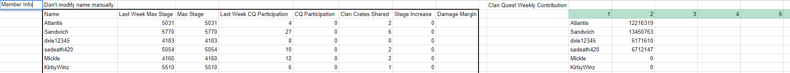

# FishBotScripts
Contains all of the scripts needed to populate the database and interacting with google spreadsheet for [FishBot](https://github.com/ygongdev/FishBot).

# Table of Contents
1. [Prerequisites](#pre)
2. [Capture Packet](#packet)
2. [Setup](#setup)
3. [Configuration](#config)
4. [Firebase](#firebase)
5. [Usage](#usage)

# Prerequisites <a name="pre"></a> #
1. You need to have an spreadsheet template that's exactly like this one: https://docs.google.com/spreadsheets/d/1SL5xFhLK9cAyjd53GJ1CYyV-GDDT3gr4Mjv0su8EpxM/edit?usp=sharing. The bot reads directly off the spreadsheet with this exact template. 
2. You need to set up a firebase database.
3. Obtain all the credentials needed for [Configuration](#config).
4. You should definiteiyl modify the source code if you've modified FishBot and are planning to use this with it. As always, if you decided to modify the source code, realize that you might need to modify FishBot accordingly in order to make them work together.

# Capture Packet <a name="packet"></a> #
In order to obtain the json files that the scripts can read from. You need to have some way to intercept network packets from the game. It is not illegal to capture packets on the client side, aka from the game to your phone, but it is illegal if you want to send a modified packet back to the game server.

## Android ##
I personally use this app called Packet Capture on an Android emulator like Nox. Set up the app and run it. Then run TT2. 

For clan information, go to TT2 and click on the icon that opens up your clan info. Check the app and see if you can find a packet that contains the clan information in app.  

For clan quest information, go to TT2 and click on the icon that opens up the clan quest (the one with the list of member contributions to the clan quest) and see if you can find a packet that contains the clan quest information in the app.

I've attached packet examples below.

## iOS ##
I haven't gotten this to work yet, but any man-in-the-middle techniques such as mitmproxy or charles might be your best bet here. All you need is to be able to retrieve those required packets.

### Example `clan information json` ###
```
{
  "members": [
    {
      "artifacts": "53", 
      "clan_code": "gg8e6", 
      "clan_icon": "14", 
      "clan_name": "Mistborns", 
      "country_code": "PT", 
      "crates_shared": "3", 
      "current_avatar": "AvatarUndisputed", 
      "equipment": [
        {
          "EquipmentCategory": "Weapon", 
          "LookID": "Weapon_GoldSword"
        }, 
        {
          "EquipmentCategory": "Hat", 
          "LookID": "Hat_MadHatter"
        }, 
        {
          "EquipmentCategory": "Suit", 
          "LookID": "Suit_DarkAlien"
        }, 
        {
          "EquipmentCategory": "Aura", 
          "LookID": "Aura_Bones"
        }, 
        {
          "EquipmentCategory": "Slash", 
          "LookID": "Slash_Ghost"
        }
      ], 
      "highest_pet_id": "Pet12", 
      "highest_tournament": "-1", 
      "last_used": "2018-01-19 00:08:47", 
      "max_prestige": false, 
      "max_stage": "7028", 
      "name": "<MST> Skim", 
      "player_code": "emmqxr", 
      "rank": 1, 
      "role": "CoLeader", 
      "score": 7028, 
      "titan_points": "1010", 
      "total_clan_quests": "401", 
      "total_tournaments": "23", 
      "weekly_dungeon_count": "17"
    }, 
    ...
```
### Example `clan quest information json` ###
```
{
  "active": false, 
  "clan_goal": 100211636, 
  "clan_level": 353, 
  "contributions": [
    {
      "artifacts": "49", 
      "clan_code": "gg8e6", 
      "clan_icon": "14", 
      "clan_name": "Mistborns", 
      "contribution": 23984702, 
      "country_code": "US", 
      "crates_shared": "4", 
      "current_avatar": "AvatarUndisputed", 
      "equipment": "[{\"EquipmentCategory\": \"Weapon\", \"LookID\": \"Weapon_BlueSword\"}, {\"EquipmentCategory\": \"Hat\", \"LookID\": \"Hat_Ghost\"}, {\"EquipmentCategory\": \"Suit\", \"LookID\": \"Suit_Ghost\"}, {\"EquipmentCategory\": \"Aura\", \"LookID\": \"Aura_Ghost\"}, {\"EquipmentCategory\": \"Slash\", \"LookID\": \"Slash_Ghost\"}]", 
      "highest_pet_id": "Pet14", 
      "highest_tournament": "-1", 
      "last_used": "2018-01-19 01:18:06", 
      "max_prestige": false, 
      "max_stage": "6574", 
      "name": "<MST>Crypto", 
      "player_code": "b6p9bm", 
      "role": "Elder", 
      "titan_points": "1312", 
      "total_clan_quests": "502", 
      "total_tournaments": "36"
    }, 
    ...
```

# Setup <a name="setup"></a> #
First of all, you will need to install Python 3.5 or above. This should include `pip`, which is an useful tool for installing Python packages.

`virtualenv` is a recommended tool for installing Python packages in an isolated environment. But it is also fine if you don't use it.

All of the python packages you need are listed inside `requirements.txt`, so all you need to do is `pip install -r requirements.txt`.
### IMPORTANT : 
You need to install a specific modified version of `Pyrebase` (a Python wrapper around `firebase`) from github. You just need to do this `pip install -e git+https://github.com/jlowin/Pyrebase@dont-modify-self#egg=Pyrebase`. I specifically wrote a function to detect if you're able to modify the entire database. If you are, then most likely, you didn't get this version of `Pyrebase`

## Configuration <a name="config"></a> ##
You'll need to create 2 files, `config.py` and `firebaseConfig.py`, which contains your own personal credentials such as tokens.

### Example `firebaseConfig.py` ###
```
import pyrebase

config = {
    "apiKey": <your api key>,
    "authDomain": <your auth domain>,
    "databaseURL": <your database url>,
    "projectId": <your project id>,
    "storageBucket": <your storage bucket>,
    "messagingSenderId": <your id>
}

firebase = pyrebase.initialize_app(config)
```

### Example `config.py` ###
```
# Modify these to the your data paths. I suggest creating a folder called data and putting them in there.
CLAN_INFO_FILE_PATH = "data/clan_info.json"
CLAN_QUEST_INFO_FILE_PATH = "data/clan_quest_info.json"
CLAN_CODE = <your clan code>
GOOGLE_SPREADSHEET_ID = <your google spreadsheet id>
GOOGLE_SPREADSHEET_API_KEY = <your google spreadsheet api key>
```

## Firebase <a name="firebase"></a> ##
I use firebase to store all of the data. You shouldn't need to touch the database at all, but you can if need to.
Here's an example of the schema. Don't be surprised if you don't see all of the fields in the database. Sometimes they are not there because firebase will not store fields with empty values, such as `damage: []`.

### Example `Clan Schema` ###
```
clan_code: {
	clan_name: <string>,
	clan_level: <number>,
	max_titans_hit: <number>
	clan_quest_duration: <array>,
	clan_quest_start_time: <array>,
	last_clan_quest_duration: <array>,
	last_clan_question_start_time: <array>,
	members: {
		member_id: {
			member_name: <string>
			max_stage: <number>
			last_week_max_stage: <number>
			damage: [<number>]
			last_week_damage: [<number>]
			clan_quest_participation: <number>
			last_week_clan_quest_participation: <number>
			clan_crates_shared: <number>
		},
		...
	}
}
```
# Usage <a name="usage"></a> #
Before running the program, make sure you have the required json files, there are two, one for clan information, and one for clan quest information. Some commands require these json files. Example of the jsons are shown below.

### Update database from json ###
Start running the program by `python main.py` or `python3 main.py`, whichever one that works.

The program will display some instructions and prompt you to enter a command. There are 4 commands:

`initial_load`: populates the database with clan info (note: no clan quests), if your clan is not in the database. Else, it fails and does nothing. Only use this command if your clan is not inside the database yet.<br>
`update_stats`: updates all clan members' stats in the database (note: no clan quest damage). This will also remove nonexisting clan members from the database as well. This reads from the clan info json.<br>
`update_damages`: updates all clan members' damages in the database (adds damage to an array of existing damages). In addition, it also updates the duration and start time of the clan quest. This reads from the clan quest info json.<br>
`weekly_reset`: move current week's stats and damages to last week and reset current week. Only do this every week after you've added all the needed data into the database.<br>

### Update spreadsheet from database ###
This approach uses Google OAuth2 with Google Sheets API. I've made the process as simple as opening an url and clicking a button

1. Start running the program by `python update_spreadsheet_from_database.py` or `python3 update_spreadsheet_from_database.py`. This will host a local web server.
2. Go to your browser and type in the link `http://localhost:8080/authorize`. This will prompt you for permission to edit the file.
3. Click allow and now the program will execute. The redirected page should inform you whether or not the execution succeeded or failed.

### Update database from spreadsheet ###
1. Start running the program by `python update_database_from_spreadsheet.py` or `python3 update_database_from_spreadsheet.py`. 
2. Repeat the same steps as above.

### Example `spreadsheet` ###



